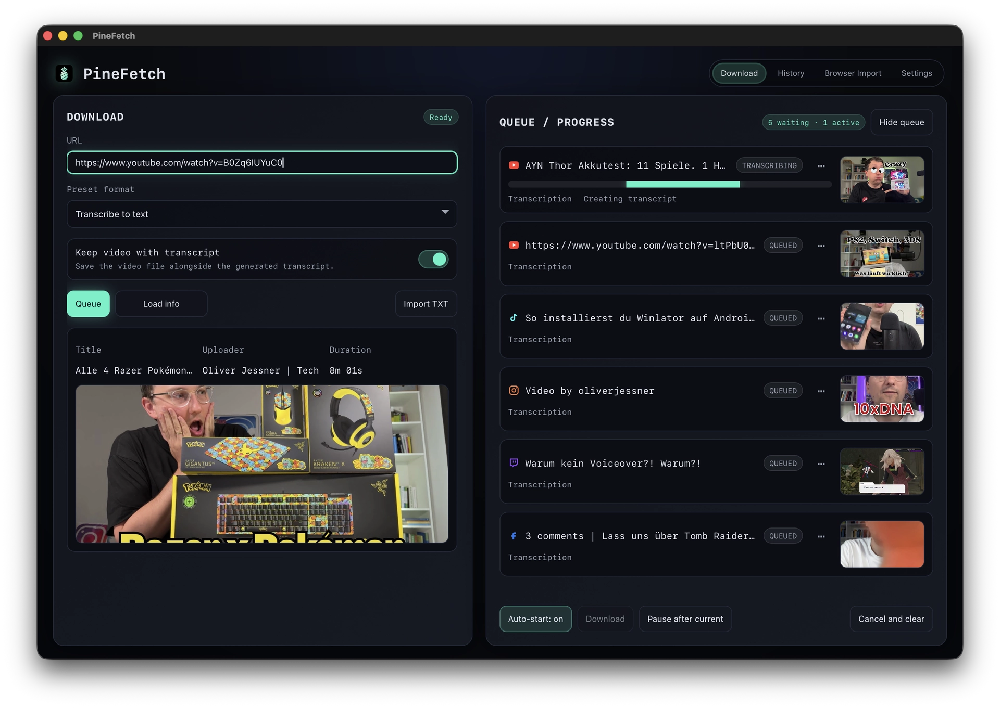
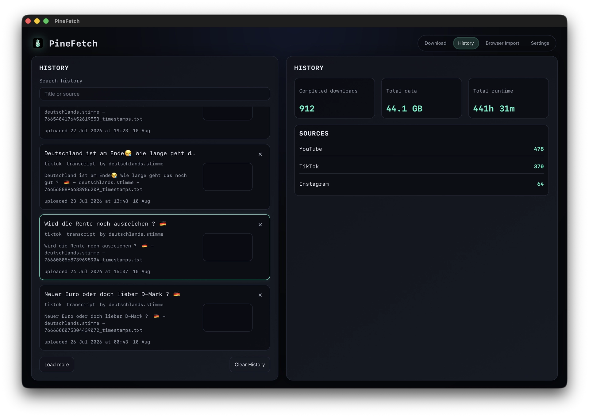
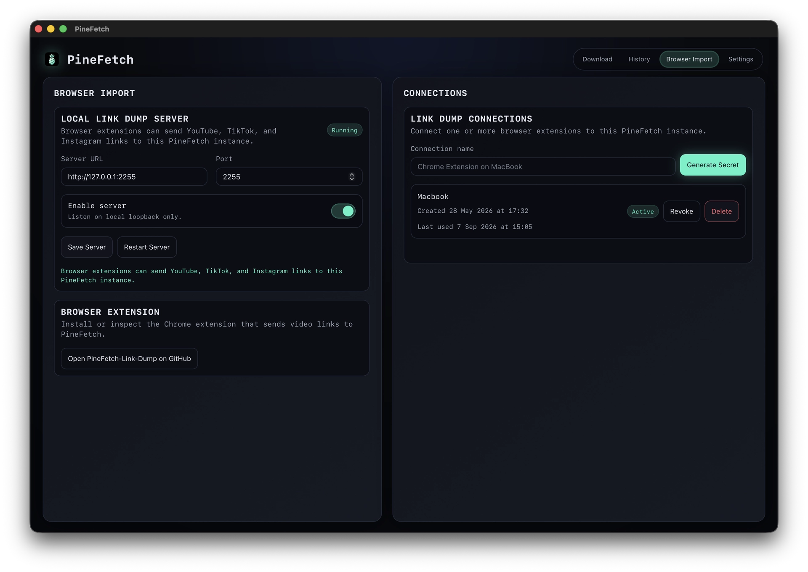
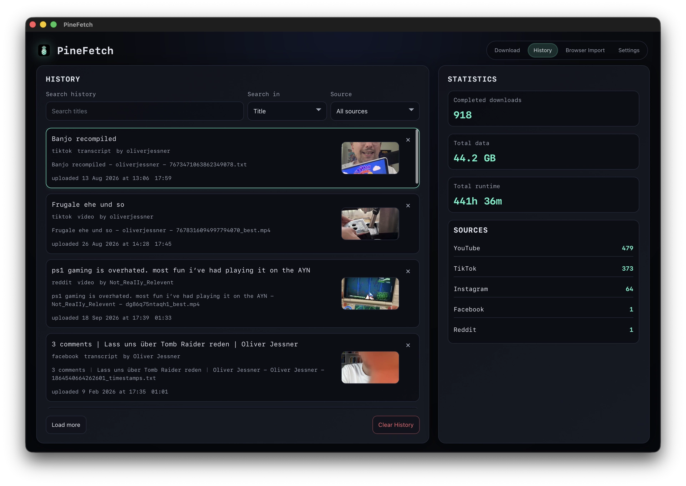

# PineFetch 🍍

**Download videos, audio, captions and transcripts without fighting the command line.**

PineFetch is a local-first desktop app built around [yt-dlp](https://github.com/yt-dlp/yt-dlp).

Paste a link, choose what you want, and PineFetch takes care of the rest.

No account. No cloud. Your files stay on your machine.



## What it does

- Download videos from YouTube, TikTok, Instagram, Facebook, Twitch, X and other sites supported by yt-dlp
- Save Instagram captions alongside your downloads and in the local SQLite database
- Extract MP3 or Opus audio
- Create local transcripts with Whisper
- Generate transcripts with timestamps
- Queue multiple downloads
- Import lists of links from TXT files
- Keep a local download history
- Control PineFetch from the command line
- Send links to PineFetch through its local Link Dump API

PineFetch is intentionally local-first. Downloads, transcripts and history stay on your computer.

See the [video and caption compatibility list](docs/COMPATIBILITY.md) for accepted links and caption behavior.

## Install

### macOS

```bash
brew tap oliverjessner/tap
brew install --cask oliverjessner/tap/pinefetch
```

Or download from the [releases](https://github.com/oliverjessner/PineFetch/releases).

## Presets

Pick what you need:

`Best` · `Max 1080p` · `MP3` · `Opus` · `Text` · `Text with timestamps`

Transcription runs locally using `faster-whisper`.

You can choose between faster or more accurate Whisper models in Settings.

## Queue, history and batch imports

Drop in one link or queue a whole list.

PineFetch can import YouTube, TikTok and Instagram URLs from a simple TXT file and process them one after another.

Your completed downloads are stored in a local history with useful stats like total downloads, storage used and runtime.



## CLI

The desktop app also includes a command-line interface.

```bash
PineFetch queue add --link 'https://www.youtube.com/watch?v=VIDEO_ID'
PineFetch queue list
PineFetch history list
PineFetch stats
```

See the [CLI documentation](docs/CLI.md) for all available commands.

## Link Dump

PineFetch can receive links from browser extensions, scripts and other local tools through its Link Dump API.

Everything runs locally on:

```text
http://127.0.0.1:2255
```

Connections are protected with a locally generated secret.



## Build it yourself

You'll need Node.js, Rust, Tauri and yt-dlp.

```bash
git clone https://github.com/oliverjessner/PineFetch.git
cd PineFetch

npm install
npm run dev
```

Create a macOS release build with:

```bash
npm run build
```

Release notes are available in the [changelog](docs/changelog.md).

## Settings

PineFetch lets you configure things like:

- Output folder
- yt-dlp path
- Transcription quality
- Keep video with transcript
- Cut downloads at timestamps
- Magic clipboard import



## A small note

PineFetch is made for content you own or have permission to download.

Please respect platform terms and local laws. PineFetch does not attempt to bypass DRM or paywalls.

## Built with

[yt-dlp](https://github.com/yt-dlp/yt-dlp) · [FFmpeg](https://ffmpeg.org/) · Tauri · Rust

## License

MIT
